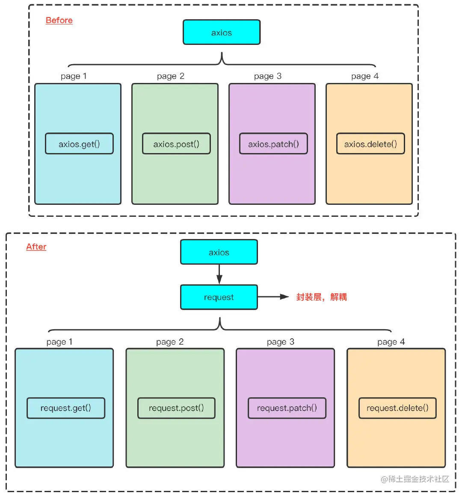

# xk-request

基于 axios 封装请求库，用于浏览器端和Node端

1. 全局添加 API 默认配置（包括请求头，请求错误处理）
2. 减少调用次数，方便使用
3. 特殊请求可配置

#### 封装思想
1. 直接使用axios，依赖性太强，如果今后更换网络请求库会很麻烦
2. 一些公共的请求功能，每次请求都需要重写配置
3. 将aixos进行加一层封装，将axios封装为自定义的request，将来直接使用request来发送网络请求就行，日后想要更换网络请求库，可以直接修改request层，将一些公共的功能封装在request层，如网络请求头添加Authorization（即token），加载loading效果等等，拦截器可以灵活封装

#### 基本封装部分
- 基本全局配置
  - baseUrl
  - 超时时间
  - header
  - responseType
  - withCredentials
  - ...
- Token,密钥等
  - 出于权限和安全考虑的密钥设置到请求头
- 响应的统一基本处理
  - 主要针对于错误的情况做全局统一处理
- 封装请求方法
  - 把对接口的请求封装为一个方法